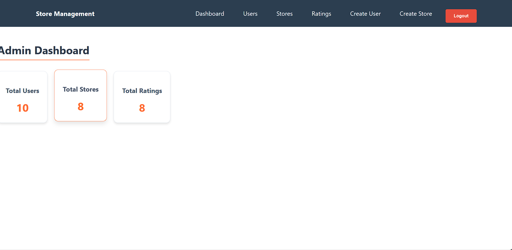

# Store Rating System

## Overview

The **Store Rating System** is a web application that allows users to rate and review stores. It includes an admin panel for managing stores, users, and ratings.

### Features
- User authentication (Login/Signup)
- Add or modify ratings of stores
- Admin panel to manage users, stores, and ratings
- Store owners can view ratings for their stores
- Responsive UI built with React

---

## Screenshots





---

## Installation and Setup

### 1. Clone the Repository
```bash
git clone https://github.com/Pruthvi070/StoreRatingSystem.git
cd StoreRatingSystem
```

### 2. Backend Setup (Node.js + Express + MySQL)

```bash
cd backend
npm install
```

#### Configure Environment Variables

Create a `.env` file inside the `backend` folder with the following content:

```
PORT=5000
DB_HOST=localhost
DB_USER=root
DB_PASS=your_database_password
DB_NAME=storeratingdb
DB_PORT=3306
JWT_SECRET=your_jwt_secret_key
```

> **Note:** Replace `your_database_password` and `your_jwt_secret_key` with your actual credentials.

#### Initialize Database and Admin User

Run these commands sequentially:

```bash
npm run pruthviraj
# Stop the server once tables are created
node setupAdmin.js
npm run pruthviraj
```

### 3. Frontend Setup (React)

```bash
cd ../frontend
npm install
npm start
```

---

## Access the Application

- Backend API: [http://localhost:5000](http://localhost:5000)
- Frontend: [http://localhost:3000](http://localhost:3000)

---

## Initial Admin Login Credentials

- **Email:** admin@admin.com
- **Password:** admin123

---

## Technologies Used

| Layer          | Technologies              |
|----------------|--------------------------|
| Frontend       | React, Redux, CSS        |
| Backend        | Node.js, Express, MySQL  |
| Authentication | JWT (JSON Web Tokens)    |

---

If you have any questions or issues, feel free to contact me.

